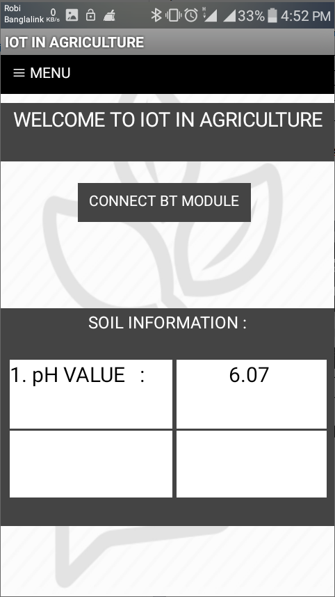
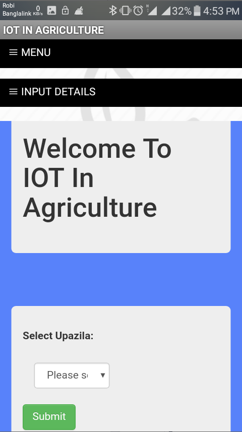
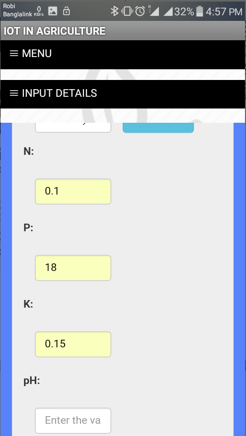
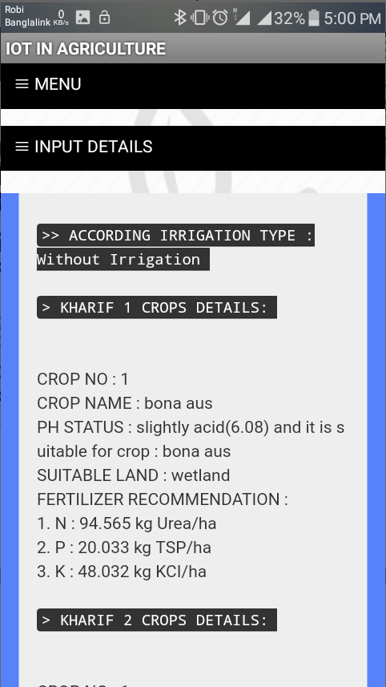
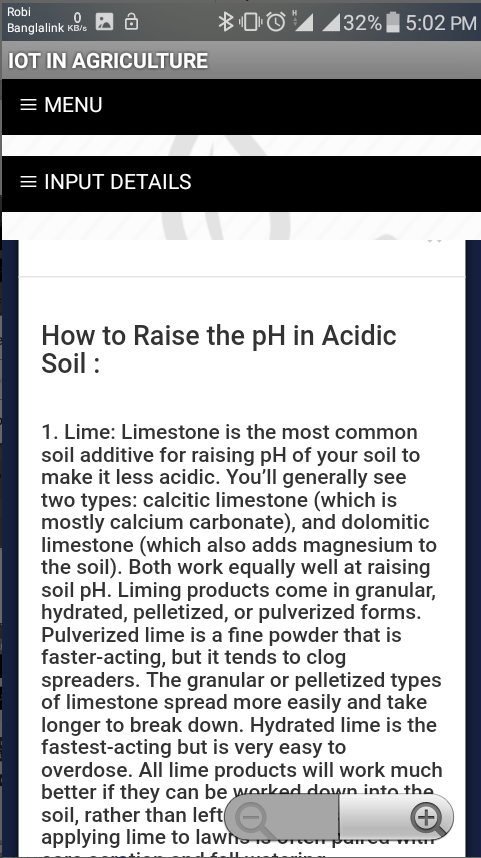
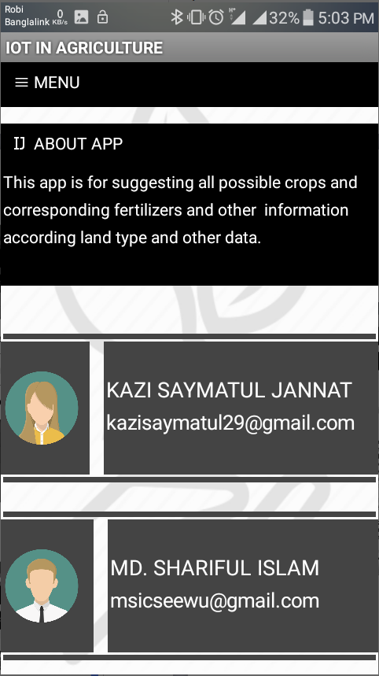

# Thesis

A hardware based system using pH sensor, Arduino language and where java platform is used as backend
and for frontend HTML, CSS and Bootstrap is used. This system has the capability to find out all possible
crops for a specific land and also provides fertilizer recommendation for all those crops as well as crop
distribution lists. A real life mobile application and a web page also designed for this system.

# Screenshots

 
 
 

